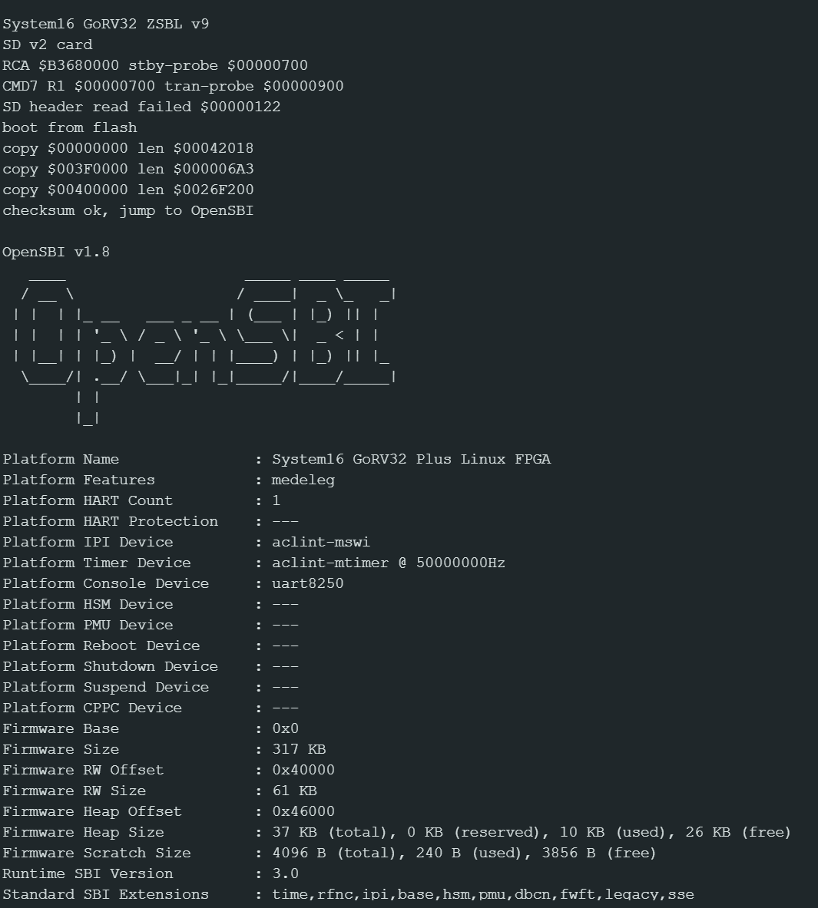

# System16 GoRV32 Plus Linux

This directory contains the software side of the hardware-verified Linux 6.12.95
port for the Tang Console 138K System16 project. Linux runs on hart 0 of the
Gowin GoRV32 Plus core; hart 1 remains parked in the ZSBL.

There are three deliberately separate profiles:

| Profile | Userspace/root | Board SD driver | Status |
| --- | --- | --- | --- |
| `flash` | embedded BusyBox initramfs | no | hardware verified |
| `rescue` | embedded BusyBox initramfs | read-only, auto-calibrating | hardware verified; preferred SD bring-up loop |
| `sd` | 512 MiB ext2 at physical LBA 32768 | read-only, auto-calibrating | experimental external-root profile |

The SD image can contain GNU make, binutils and a native GCC, and that image is
covered by the QEMU test. The current hardware driver intentionally exposes the
card read-only because CMD24 writes are not reliable yet. Do not describe this
profile as writable until the write path and filesystem integrity tests pass.
The complete build procedure is in [linux-build-image.md](linux-build-image.md).
For adding a new MMIO peripheral, coprocessor or Linux platform driver, see
[hardware-treiber-entwicklung.md](hardware-treiber-entwicklung.md).

## Hardware boot capture



The capture shows the SD-first GRV1 copy layout and OpenSBI hand-off used by
the current ZSBL v12.

## Boot chain

1. The FPGA loads its bitstream from the board's 8 MB XT25F64B flash.
2. GoRV32 Plus resets at CPU address `0x80000000`. Its XIP window maps this
   address to flash offset `0x500000`, where the ZSBL executes in place.
3. ZSBL v12 initializes UART1 and first validates the GRV1 image at SD LBA 0.
   If the card or image is unavailable, it tries the fallback GRV1 container
   at flash offset `0x510000`.
4. The ZSBL copies OpenSBI, the DTB and Linux into SDRAM0, verifies the
   additive payload checksum and jumps to OpenSBI at address zero.
5. OpenSBI starts Linux at `0x00400000`. The `flash` and `rescue` profiles
   start their embedded BusyBox initramfs; the `sd` profile mounts
   `/dev/gorv32sd` read-only.

The GRV1 container is little-endian. It starts with a header containing the
magic, record count and checksum, followed by `(source offset, destination,
length)` records. Each payload begins on a 512-byte boundary so the SD path can
copy complete sectors directly into SDRAM. `tools/make_gorv32_flash_image.py`
is the authoritative format implementation.

## Address layout

| Space | Address | Contents |
| --- | ---: | --- |
| Flash | `0x000000` | FPGA bitstream, approximately 4.9 MB |
| Flash | `0x500000` | ZSBL; also the IP Core Generator `Flash_Burn_Address` |
| Flash | `0x510000` | Optional fallback GRV1 image |
| SD | LBA 0 | Primary raw GRV1 boot container |
| SD | LBA 32768 | SD profile's 512 MiB ext2 root filesystem |
| CPU XIP | `0x80000000` | ZSBL mapping of flash offset `0x500000` |
| SDRAM | `0x00000000` | OpenSBI (`FW_TEXT_START=0`) |
| SDRAM | `0x003f0000` | `gorv32plus.dtb` |
| SDRAM | `0x00400000` | Linux `Image`; initramfs in `flash`/`rescue` only |
| MMIO | `0xe4000000` | PLIC |
| MMIO | `0xe6000000` | CLINT |
| MMIO | `0xf0200020` | UART1 16550 register window |
| MMIO | `0xf0600000` | Vendor SD host |

Linux sees 12 MB from `0x00400000` through `0x00ffffff`. The lower 4 MB are
reserved for OpenSBI and the DTB. The complete kernel plus initramfs must fit
in the remaining region. The optional flash fallback slot has a stricter
2.9 MB GRV1 size limit; SD boot is not restricted by that flash boundary.

The UART uses 115200 baud, 8 data bits, no parity and one stop bit. Its APB
registers use 32-bit accesses and a four-byte stride. The small ZSBL SD reader
identifies cards at 200 kHz and transfers at 1 MHz, preferring four-bit
mode after ACMD6. This is independent of the Linux driver described below.

## Auto-calibrating Linux SD driver

`kernel/gorv32_sd.c` is a polling block driver for the vendor host at
`0xf0600000`. During probe it establishes a repeatable one-bit reference, then
tests all 50 combinations of one-/four-bit mode and dividers 0 through 24
(25 MHz down to 1 MHz). A candidate is rejected on a transfer failure, retry,
RX-FIFO-full event or byte mismatch. The three fastest short-run candidates
receive a 64-sector verification and the winner is checked once more before
the block device is registered. A later runtime retry or FIFO-full event halves
the clock automatically; runtime up-clocking is intentionally avoided.

Hardware result on 2026-07-12 with the current card and bitstream:

```text
auto calibration selected 1-bit divider 9 (2500000 Hz, 161 KiB/s); 29/50 sweep modes, 3 long-run modes passed
read benchmark: 16 sectors in 42 ms (190 KiB/s), 0 retries, 0 FIFO-full events
1048576 sectors at physical LBA 32768, 1-bit, native word order
```

The result is measured on every boot and is not hard-coded; another card can
select a different mode. Both board DTS files set `gowin,read-only`, so Linux
cannot issue the still-unproven CMD24 path.

## Source and generated files

- `gorv32plus.dts`, `gorv32plus-rescue.dts` and `gorv32plus-sd.dts` describe
  the three profiles.
- `system16-flash.config`, `system16-rescue.config` and `system16-sd.config`
  are their kernel fragments; `system16-qemu-sd.config` replaces the board
  host with virtio for the rootfs test.
- `kernel/gorv32_sd.c` is the built-in polling block driver for the SD profile.
- `build-kernel.sh` builds `flash`, `rescue`, `sd` or `qemu-sd` (`flash` is
  the default).
- `zsbl/crt.S`, `zsbl/main.c`, `zsbl/zsbl.lds` and `zsbl/build.sh` are the
  versioned freestanding XIP bootloader sources; `zsbl.bin` and `zsbl.elf` are
  generated from them and deliberately remain untracked.
- `../tools/build_rootfs_wsl.py` creates a static uClibc/BusyBox cpio with
  Buildroot 2025.02.
- `../tools/build_opensbi_gorv32_wsl.py` builds OpenSBI at address zero.
- `../tools/import_gorv32_from_wsl.py` validates and imports the WSL artifacts
  and compiles `gorv32plus.dts`.
- `../tools/build_rootfs_sd_wsl.py` creates the ext2/toolchain root filesystem.
- `buildroot/` is the versioned BR2_EXTERNAL tree for that filesystem.
- `../tools/make_gorv32_flash_image.py` creates a GRV1 boot container.
- `../tools/make_gorv32_sd_card_image.py` combines GRV1 and ext2.

Generated artifacts are intentionally not repository sources: Gowin `impl/`
output, `zsbl.bin`, `zsbl.elf`, the Linux build tree and `build/gorv32-linux-*`
can all be recreated. The Gowin IP's editable `.ipc` and synthesizable
encrypted `.v` are retained with the project, matching the policy used by the
other Gowin board ports.

## Build order

The Windows targets call the default WSL distribution. Commands below are run
from the repository root. Build the common boot firmware when it changes:

```powershell
make -C boards/tang_mega_138k/system16 gorv32-zsbl-wsl
make -C boards/tang_mega_138k/system16 gorv32-opensbi-wsl
```

The recommended driver-development loop is the rescue profile:

```powershell
make -C boards/tang_mega_138k/system16 rootfs-flash-wsl  # once
make -C boards/tang_mega_138k/system16 kernel-rescue-wsl
make -C boards/tang_mega_138k/system16 gorv32-rescue-image
```

Program only
`build/gorv32-linux-rescue/gorv32-linux-rescue.bin` at flash `0x510000`.
The initramfs starts without SD, so a driver failure cannot prevent access to
the shell. No SD card rewrite or FPGA rebuild is needed for this loop.

Provision the external-root card only for a new or changed root filesystem:

```powershell
make -C boards/tang_mega_138k/system16 rootfs-sd-wsl
make -C boards/tang_mega_138k/system16 kernel-sd-wsl
make -C boards/tang_mega_138k/system16 gorv32-sd-image
```

This creates `build/gorv32-linux-sd/gorv32-linux-sd.img`. For later kernel,
DTB or driver iterations leave the card untouched and use:

```powershell
make -C boards/tang_mega_138k/system16 kernel-sd-wsl
make -C boards/tang_mega_138k/system16 gorv32-sd-boot-image
```

Write the resulting `gorv32-linux-sd-boot.bin` raw at SD LBA 0; this replaces
only the boot records before the ext2 filesystem. Use `qemu-sd-test` to
validate the Buildroot filesystem and native compiler through virtio; QEMU
does not exercise the Gowin SD host. See
[linux-build-image.md](linux-build-image.md) and
[gorv32-brennen.md](gorv32-brennen.md) for complete details.

## Expected console and diagnostics

The successful sequence starts with:

```text
FPGA BOOT OK
System16 GoRV32 ZSBL v12 SD-first
boot from SD
copy $00000000 len $...
copy $003F0000 len $...
copy $00400000 len $...
checksum ok, jump to OpenSBI
OpenSBI ...
[    0.000000] Linux version ...
gorv32-sd f0600000.sdhost: auto calibration: testing ...
gorv32-sd f0600000.sdhost: auto calibration selected ...
gorv32-sd f0600000.sdhost: read benchmark: ... 0 retries, 0 FIFO-full events
```

After initramfs startup, BusyBox supplies the minimal user space and shell.
The HDMI top stripe is a coarse hardware diagnostic: red means no CPU UART or
DDR traffic, blue means DDR reads without UART, magenta means DDR writes
without UART, yellow means UART without DDR, cyan means UART plus reads, and
green means UART plus a DDR write. Green proves the chain through the ZSBL copy
loop, but the UART log remains the authoritative boot result.

## Known constraints

- Do not use flash offsets at or above `0x800000`: they exceed the physical
  8 MB device and can wrap over the bitstream.
- The GoRV32 Plus project must not include `VexRiscvSystem16.v`; the encrypted
  vendor core contains its own `VexRiscv` module.
- The vendor IP owns the QSPI and SD I/O buffers. Fabric logic must not also
  drive or probe those pads, or synthesis reports EX0339.
- OpenSBI 1.8.1 requires the local pre-MDT `fw_base.S` adjustment implemented
  by the build helper for this privilege-architecture implementation.
- The Linux SD device is read-only. CMD17 reads are hardware verified; CMD24
  writes and writable ext2/swap operation are not.
- QEMU validates the generic RV32 kernel and early console, not the board's
  XIP, AXI-to-SDRAM bridge, SD host or UART wiring.
