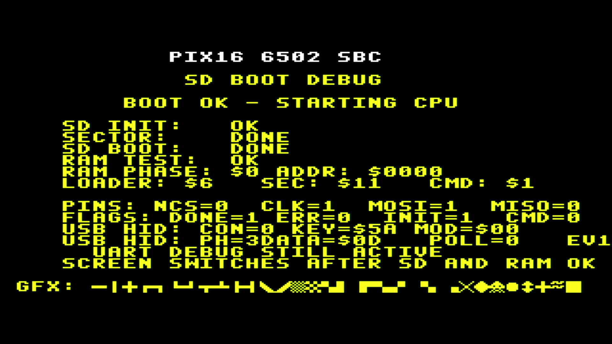
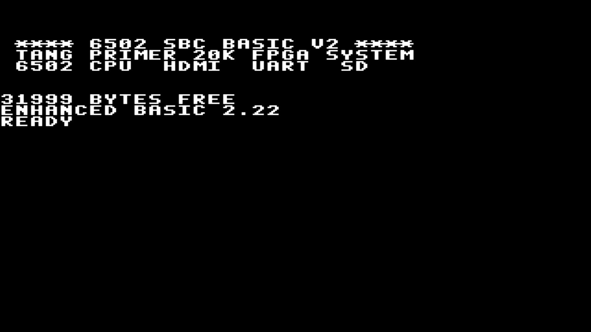
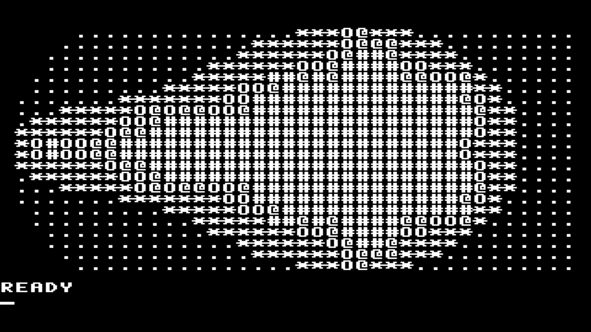
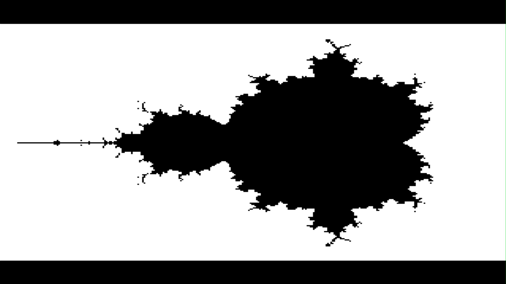
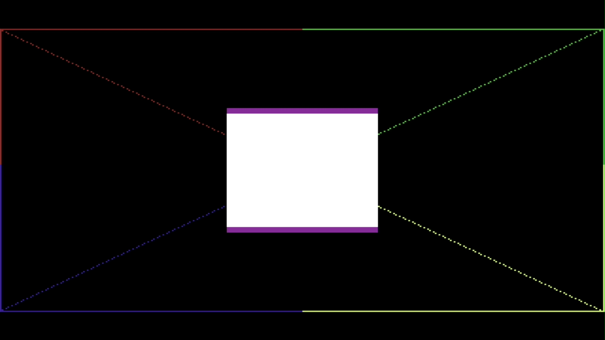
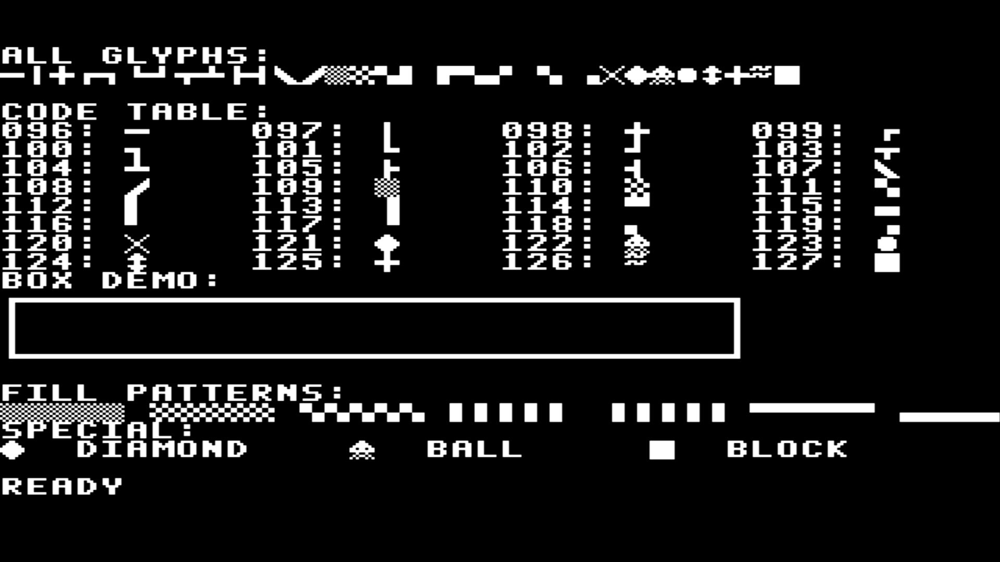

# FPGA Image Captures

This directory contains real screenshots captured from the FPGA hardware output.

The images are not emulator renders. They show the HDMI video signal generated by
the FPGA design running on the target board. The HDMI output was recorded through
an external video capture device / HDMI grabber and then saved as image files for
documentation and regression reference.

## Captures

### Tang Primer Debug Screen

Tang Primer 20K HDMI boot/debug screen captured from the live FPGA output.

### EhBASIC Boot

EhBASIC boot screen captured after the FPGA SD/ROM boot path starts BASIC.

### Mandelbrot BASIC Demo (Text Mode)

Mandelbrot set rendered as ASCII art in text mode (`mandelbrot.bas`). Uses
character density mapping with 12 iterations on a 39x23 grid.

### Mandelbrot (Bitmap Mode, Monochrome)

Mandelbrot set rendered in 320x200 bitmap mode with 16 iterations. Black pixels
represent the set interior, white pixels the escaped exterior. Demonstrates the
FPGA VIC bitmap rendering pipeline with full pixel resolution.

### Bitmap Mode Graphics Test

Output of `bitmaptest.bas` running in 320x200 bitmap mode. Shows a pixel-level
border frame, diagonal lines from corner to corner, a filled rectangle, and four
colored quadrants (red, green, cyan, yellow) using per-8x8-cell color attributes
from color RAM. The center box has a white-on-purple color overlay.

### PETSCII Test

PETSCII/VIC text-mode graphics test captured from the live FPGA HDMI output.
Verifies the character ROM, PETSCII block/line-drawing glyphs ($60-$7F), and
the CPU-to-VRAM write path.

